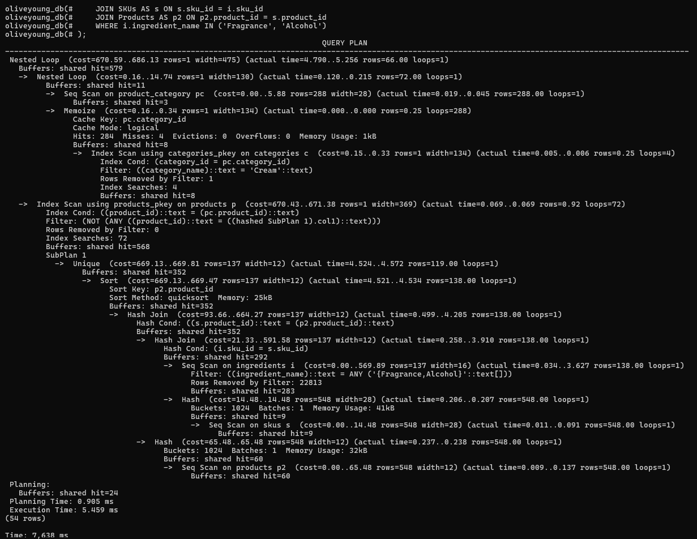
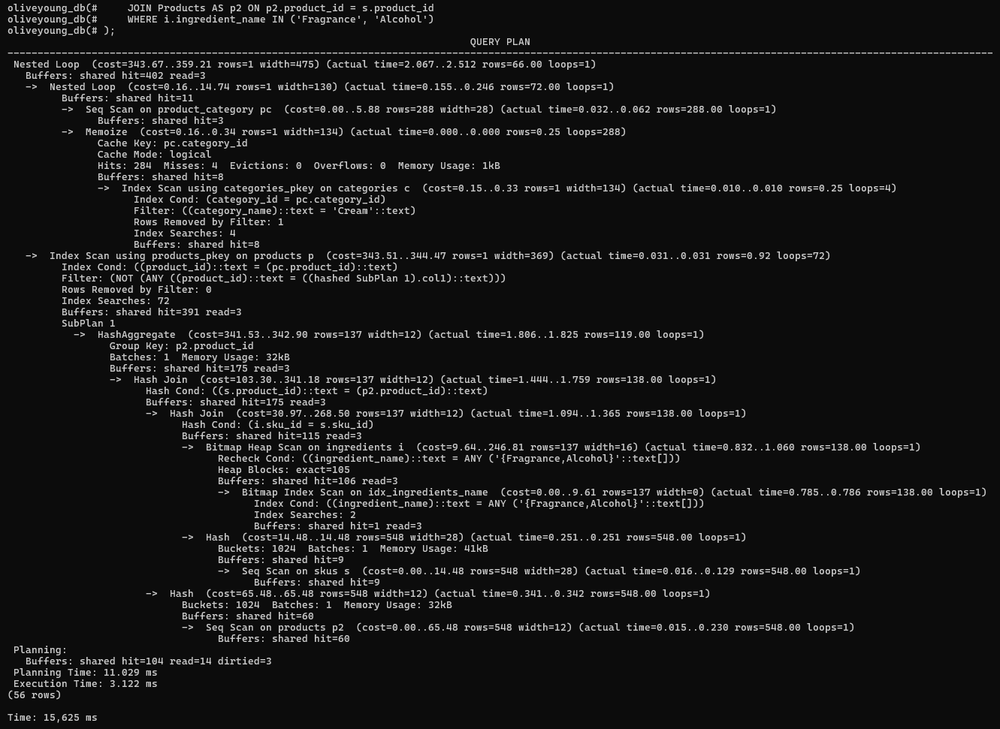
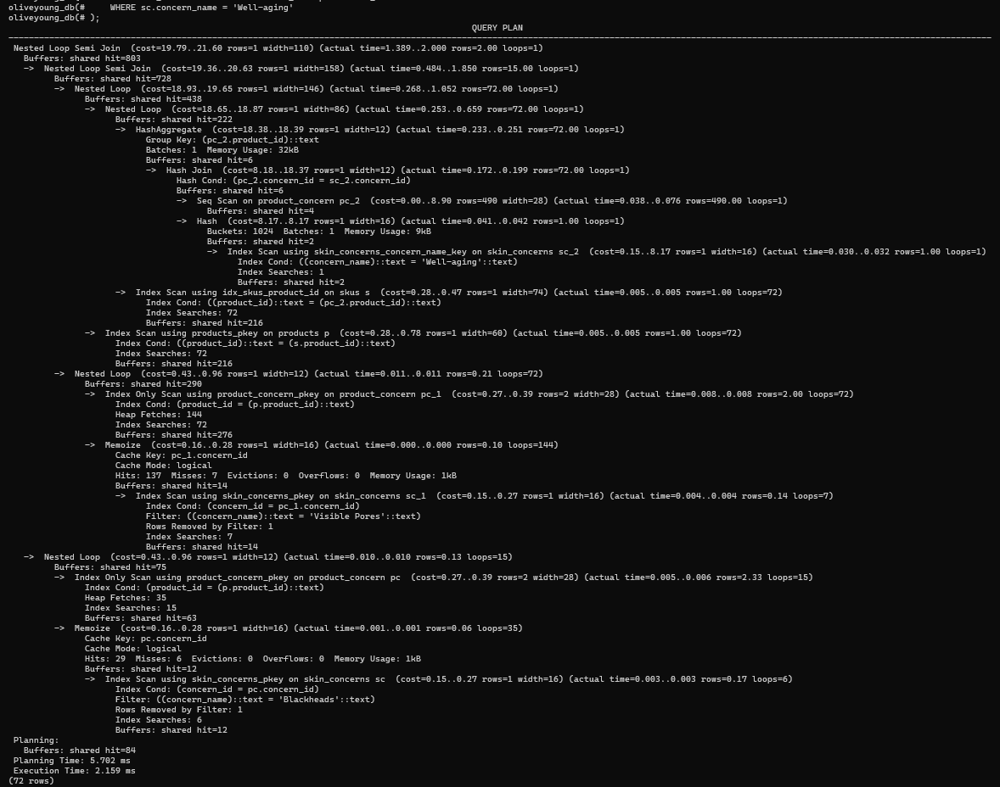
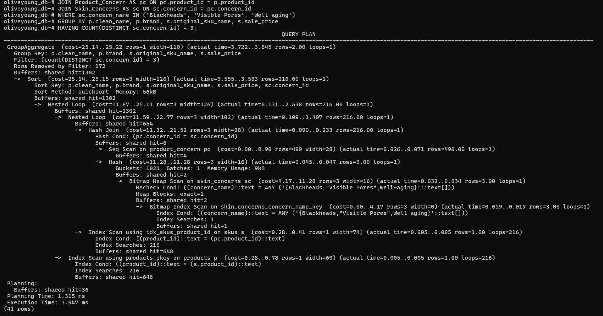
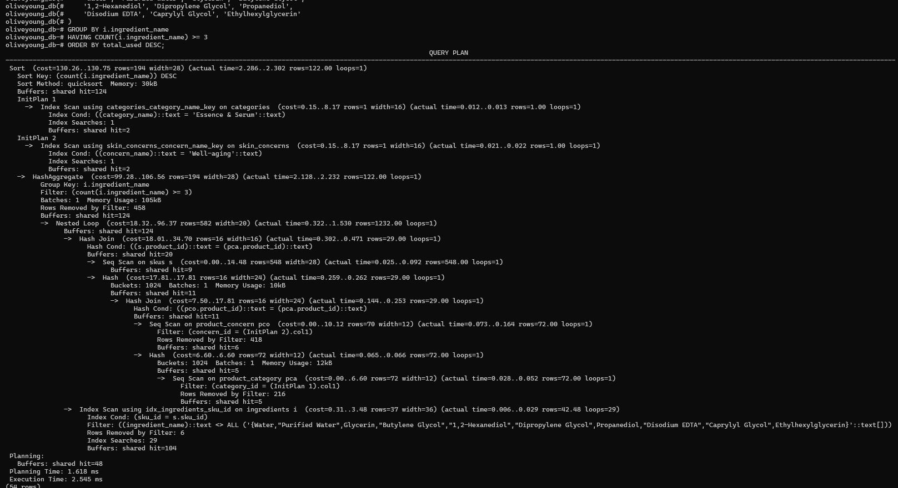
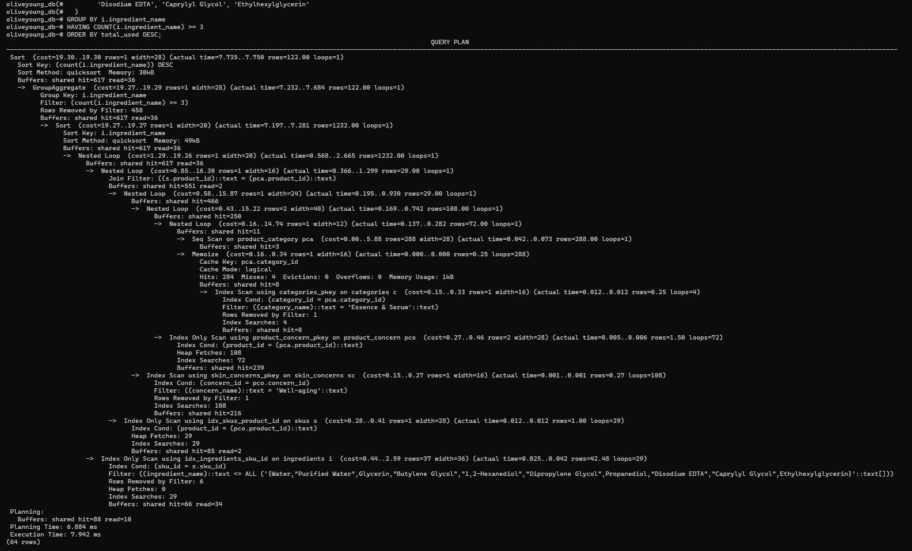

# BONUS - Optimasi Query

Folder bonus ini berisi 3 kueri optimasi untuk database Olive Young (oliveyoung_db).

## Informasi 1: Analisis Produk Hypoallergenic
Query ini bertujuan untuk mencari daftar nama skincare kategori **Cream** yang cocok untuk tipe kulit **Sensitif** dengan memastikan bahwa skincare tersebut bebas dari komposisi pemicu iritasi, biasanya *fragrance* atau *alcohol*.

Sebelum:

**Strategi Optimasi:** Penerapan B-Tree Indexing pada relasi yang terlibat, seperti Ingredients, SKUs, dan Product_Category untuk menghilangkan sequential scan, sehingga menurunkan execution time.

Sesudah:

## Informasi 2:
Query ini bertujuan untuk mencari produk yang mampu menangani 3 masalah kulit sekaligus, misalnya **Blackheads, Visible Pores, dan Well-aging**. Selain itu, query ini juga akan menampilkan harga jualnya.

Sebelum: 

**Strategi Optimasi:** Melakukan query tuning untuk menghilangkan multiple subqueries menggunakan metode HAVING COUNT sehingga database engine hanya perlu melakukan 1 kali hash join.

Sesudah:

## Informasi 3:
Query ini bertujuan untuk menganalisis bahan kimia yang paling sering digunakan pada skincare **Essence & Serum** yang menargetkan masalah kulit **Well-aging** dengan menghilangkan base ingredients dari daftar.

Sebelum:

**Strategi Optimasi:** Menggunakan composite index untuk menurunkan total cost melalui index only scan.

Sesudah:
